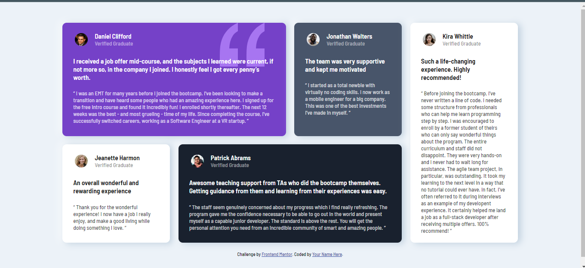

# Frontend Mentor - Testimonials grid section solution

This is a solution to the [Testimonials grid section challenge on Frontend Mentor](https://www.frontendmentor.io/challenges/testimonials-grid-section-Nnw6J7Un7). Frontend Mentor challenges help you improve your coding skills by building realistic projects.

## Table of contents

- [Overview](#overview)
  - [The challenge](#the-challenge)
  - [Screenshot](#screenshot)
  - [Links](#links)
- [My process](#my-process)
  - [Built with](#built-with)
  - [What I learned](#what-i-learned)
  - [Continued development](#continued-development)
- [Author](#author)

## Overview

### The challenge

Users should be able to:

- View the optimal layout for the site depending on their device's screen size

### Screenshot

Desktop view

### Links

- Solution URL: [Solution](https://github.com/MelakuAlehegn/testimonials-grid-section-main)
- Live Site URL: [Live site](https://melakualehegn.github.io/testimonials-grid-section-main/)

## My process

### Built with

- Semantic HTML5 markup
- CSS custom properties
- Flexbox
- CSS Grid

### What I learned

I have explored grid css for the first time with this project. I was able to grab the basics and more than I expected.

### Continued development

I want to improve my responsive design and mobile first design overflows

## Author

- Frontend Mentor - [@yourusername](https://www.frontendmentor.io/profile/MelakuAlehegn)
- Twitter - [@yourusername](https://www.twitter.com/MelakuA5)
